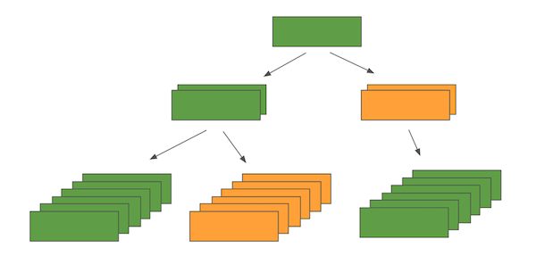

Heterogeneous GraphSAGE (HinSAGE)
===================================

This document outlines the viability and potential methodology to
generalise the GraphSAGE algorithm [1] for
heterogeneous graphs i.e. graphs containing many different node and edge
types.

Feature updates for homogeneous graphs
--------------------------------------

The feature update rule for homogeneous graphs is, for mean aggregator:

1. Aggregation of features from the neighbours of node :math:`v`:

   :math:`{h^{k}}_{N(v)} = \frac{1}{|N(v)|}D_{p}\lbrack{h_{u}}^{k - 1}\rbrack`

2. Forward pass through layer :math:`k`:

   If ``concat=True``:

   :math:`{h_{v}}^{k} = \sigma\left( concat\lbrack{W^{k}}_{\text{self}}D_{p}\lbrack{h_{v}}^{k - 1}\rbrack,\ {W^{k}}_{\text{neigh}}{{h}^{k}}_{N(v)}\rbrack + b^{k} \right)`

   If ````concat=False````:

   :math:`{h_{v}}^{k} = \sigma\left( {W^{k}}_{\text{self}}D_{p}\lbrack{h_{v}}^{k - 1}\rbrack + \ {W^{k}}_{\text{neigh}}{h^{k}}_{N(v)} + b^{k} \right)`

Where:

-  :math:`{h_{v}}^{k}` is the output for node :math:`v` at layer :math:`k`

-  :math:`{W^{k}}_{\text{self}}` and :math:`{W^{k}}_{\text{neigh}}` (both of size :math:`\frac{d_{k}}{2} \times d_{k - 1}` if ``concat=True``, or of size :math:`d_{k} \times d_{k - 1}` if ``concat=False``) are trainable parameters (shared for all nodes :math:`v`),

-  :math:`b^{k}` is an optional bias,

-  :math:`d_{k}` is node feature dimensionality at layer :math:`k`,

-  :math:`\sigma` is the nonlinear activation,

-  :math:`N(v)` is the neighbourhood of node :math:`v`

-  :math:`D_{p}\lbrack \cdot \rbrack`\ is a random dropout with probability :math:`p` applied to its argument vector.

The number of trainable parameters in layer :math:`k` for the mean
aggregator is

   :math:`d_{k}d_{k - 1} + d_{k}` if ``concat=True``, or

   :math:`{2d}_{k}d_{k - 1} + d_{k}` if ``concat=False``.

For the GCN aggregator, the feature update rule is:

1. | Aggregation of features from the neighbours of node :math:`v`:

   :math:`{h^{k}}_{N(v)} = \frac{1}{|N(v)| + 1}\left({h_{v}}^{k - 1} + \sum_{u \in N(v)}{h_{u}}^{k - 1}\right)`

2. Forward pass through layer k:

..

   :math:`{h_{v}}^{k} = \sigma\left( W^{k} \cdot {h^{k}}_{N(v)} + b^{k} \right)`,

where :math:`W^{k}` (size :math:`d_{k} \times d_{k - 1}`)
is a trainable weight matrix, shared between all nodes :math:`v` and
other notation is as for the mean aggregator.

The number of trainable parameters in layer :math:`k` for the GCN
aggregator is :math:`d_{k}d_{k - 1} + d_{k}`, i.e., this model has the
same expressive power as the model with the mean aggregator and
``concat=True``, or about half the expressive power of the model with the
mean aggregator with ``concat=False``.

Defining additional weight matrices to account for heterogeneity
----------------------------------------------------------------

To support heterogeneity of nodes and edges we propose to extend the
GraphSAGE model by having separate neighbourhood weight matrices
(W\ :sub:`neigh`\ ’s) **for every unique ordered tuple of (N1, E, N2)**
where N1, N2 are node types, and E is an edge type. In addition the
heterogeneous model will have separate self-feature matrices :math:`W_{\text{self}}`
for every node type (this is equivalent to having a unique self-edge
type for every node type).

Note that if we enforce that every edge is only associated with a single
type for the starting and ending nodes (i.e. N1 and N2 are known if E is
specified) this is equivalent to having separate neighbourhood weight
matrices (:math:`W_{\text{neigh}}`'s) **for every edge type E**. However, for
two node types (N1 and N2) we can have multiple edge types.

For example, to enforce that if you need a single edge of type *nextTo*
that can either be:

Person - *nextTo* -> Person

Person - *nextTo* -> Dog

Dog - *nextTo* -> Person

Dog - *nextTo* -> Dog

you should actually define 4 different edge types such that:

Person - *nextToPP* -> Person

Person - *nextToPD* -> Dog

Dog - *nextToDP* -> Person

Dog - *nextToDD* -> Dog

Feature updates for heterogeneous graphs (HINs)
-----------------------------------------------

The resulting feature update rules on heterogeneous graphs, for mean and
GCN aggregators, are shown below (compare with the feature update rules
for homogeneous graphs above).

HinSAGE with mean aggregator
~~~~~~~~~~~~~~~~~~~~~~~~~~~~~~~~~~~~

1. Aggregation (mean) of features from the neighbours of node :math:`v` via edges of type :math:`r`:

   :math:`{h^{k}}_{N_{r}(v)} = \frac{1}{|N_{r}(v)|}\sum_{u \in N_r(v)}D_{p}\lbrack{h_{u}}^{k - 1}\rbrack`

2. Forward pass through layer k:

If ``concat=Partial``:

   :math:`{h_{v}}^{k} = \sigma\left( \text{concat}\lbrack{W^{k}}_{t_{v}, \text{self}}D_{p}\lbrack{h_{v}}^{k - 1}\rbrack, {W^{k}}_{r, \text{neigh}} {h^{k}}_{N_{r}(v)}\rbrack + b^{k} \right)`

If ``concat=Full``:

   :math:`{h_{v}}^{k} = \sigma\left( \text{concat}\lbrack{W^{k}}_{t_{v},\text{self}}D_{p}\lbrack{h_{v}}^{k - 1}\rbrack, {W^{k}}_{1,\text{neigh}} {h^{k}}_{N_{1}(v)},\ldots, {W^{k}}_{R_{e},\text{neigh}}{h^{k}}_{N_{R_{e}}(v)}\rbrack + b^{k} \right)`

If ``concat=False``:

   :math:`{h_{v}}^{k} = \sigma\left( {W^{k}}_{t_{v},\text{self}}D_{p}\lbrack{h_{v}}^{k - 1}\rbrack  + {W^{k}}_{r,\text{neigh}}{h^{k}}_{N_{r}(v)} + b^{k} \right)`

Where:

-  :math:`{W^{k}}_{t_{v},\text{self}}` is the weight matrix for self-edges for node type :math:`t_{v}`\ and is of shape

      :math:`(\frac{{d_{k}}}{2}) \times d_{k - 1}` if ``concat=Partial`` or

      :math:`d_{k} \times d_{k - 1}` if ``concat=False``, or

      :math:`\frac{d_{k}}{R_{e} + 1} \times d_{k - 1}`\ if ``concat=Full``.

-  :math:`{W^{k}}_{r,\text{neigh}}` is the weight matrix for edges of type :math:`r` and is of shape

      :math:`\frac{d_{k}}{2} \times d_{k - 1}(r)` if ``concat=Partial`` or

      :math:`\frac{d_{k}}{2} \times d_{k - 1}(r)` if ``concat=False``, or

      :math:`\frac{d_{k}}{R_{e} + 1} \times d_{k - 1}(r)` if ``concat=Full``.

-  :math:`r` denotes the edge type from node :math:`v` to node :math:`u` (:math:`r` is defined as unique tuple :math:`(t_{v},t_{e},t_{u})`), where :math:`t_{v}` denotes type of node :math:`v`, and :math:`t_{e}` denotes the relation type.

-  :math:`N_{r}(v)` is a neighbourhood of node :math:`v` via edge type :math:`r`.

-  :math:`d_{k - 1}(r) = dim({h^{k}}_{N_{r}(v)})` is the dimensionality of (:math:`k - 1`)-th layer’s features of node :math:`v`’s neighbours via edge type :math:`r`.

The number of trainable parameters per layer :math:`k` for this model is

-  If ``concat=Partial``:

    :math:`T_{v}(\frac{d_{k}}{2}) d_{k - 1} + R_{e} (\frac{d_{k}}{2})d_{k - 1} + d_{k} = \frac{T_{v} + R_{e}}{2} d_{k}d_{k - 1} + d_{k}`

-  If ``concat=False``:

    :math:`T_{v}d_{k} d_{k - 1} + R_{e} d_{k} d_{k - 1} + d_{k} = (T_{v} + R_{e}) d_{k}d_{k - 1} + d_{k}`

-  If ``concat=Full``

    :math:`\frac{T_{v}d_{k}}{R_{e} + 1} d_{k - 1} + R_{e} \frac{d_{k}}{R_{e} + 1}d_{k - 1} + d_{k} = d_{k}d_{k - 1}\frac{T_{v} + R_{e}}{R_{e} + 1} + d_{k}`.

assuming that the dimensionalities of all destination node features for all edge types :math:`r` are all equal, i.e. :math:`d_{k - 1}(r) = d_{k - 1} \forall r`, the number of all node types in the graph is :math:`T_{v}`, and the number of all edge types is :math:`R_{e}`.

HinSAGE with GCN aggregator
~~~~~~~~~~~~~~~~~~~~~~~~~~~~~~~~~~~

For GCN aggregator, the feature update rule is:

1. Aggregation of features from the neighbours of node :math:`v`, and node :math:`v` itself:

   :math:`{h^{k}}_{N_{r}(v)} = \frac{1}{|N_{r}(v)| + 1}\left( {h_{v}}^{k - 1} + \sum_{u \in N_r(v)}{h_{u}}^{k - 1} \right)`

2. Forward pass through layer k:

..

   :math:`{h_{v}}^{k} = \sigma\left( \frac{1}{R_{e}}{W_{r}}^{k} \cdot {h^{k}}_{N_{r}(v)} + {b^{k}}_{} \right)`

where :math:`{W_{r}}^{k}` are trainable weight matrices of size :math:`d_{k} \times d_{k - 1}`, one per edge type :math:`r`.

Note that in this model the dimensions of :math:`{h_{u}}^{k - 1}`\ for :math:`u \in N_{r}(v)` for different edge types :math:`r` must be the same as the dimensionality of :math:`{h_{v}}^{k - 1}`. This can be assumed to be true after the first layer as the bias vector :math:`b^{k}` in the update formula does not differ by node type.

However, if the dimensions of :math:`{h_{u}}^{k - 1}`\ for :math:`u \in N_{r}(v)` differs from the size of :math:`{h_{v}}^{k - 1}` another weight matrix of size :math:`d_{k} \times d_{k - 1}(v)` is required in front of the :math:`{h_{v}}^{k - 1}` term. This would be similar to the :math:`{W^{k}}_{\text{self}}`\ weight matrix of the mean
aggregator.

The number of trainable parameters per layer :math:`k` for this model
is:

   :math:`R_{e}d_{k}d_{k - 1} + d_{k}`

i.e., the model with GCN aggregator is less expressive (and hence less
prone to overfitting in case of small datasets) than the model with mean
aggregator.

Supervised Node Attribute Inference
-----------------------------------

Although HinSAGE allows you to aggregate information from different node
types, the “target” nodes for supervised attribute inference must still
be of a particular node type. However, this is unlikely to be an issue
since an attribute you want to infer should really only belong to a
particular type of node in most cases.

Data Preparation
~~~~~~~~~~~~~~~~

The input batch is best described with a diagram of an example. Given a
graph schema where:

-  GREEN nodes have other GREEN neighbours and ORANGE neighbours

-  ORANGE nodes only have GREEN neighbours

and you want to infer attributes on nodes of type GREEN, you can expect
a heterogeneous input batch like below:

|hinsage-tree|

The diagram corresponds to sampling 2 neighbours at the first “hop”, and 3 neighbours at the second “hop”. From this you can imagine what the input batch should look like with arbitrary numbers of hops and number of neighbour samples at each hop. Since Keras layers only accept a list of tensors (rather than a tree) as an input, the HinSAGE layer requires an additional parameter to describe how the input list of tensors should be interpreted as a tree structure.

Additional Layers & Loss Calculation
~~~~~~~~~~~~~~~~~~~~~~~~~~~~~~~~~~~~

Depending on the exact type of attribute inference you want to perform,
the final classifier layer of the model may vary - e.g. binary
classification, multiclass classification, regression, etc., with the
corresponding loss function to be optimised. You can simply treat the
output from the final layer of GraphSAGE/HinSAGE as node embeddings, and
add Keras layers on top to perform the downstream task (e.g., node
classification). The resulting model can then be trained end-to-end,
learning the parameters of all layers at once (i.e., both the embedding
layers and the final classifier/regression layer on top) via optimising
the downstream task’s loss function on the training set. In this case
the embeddings generated from this approach will be tailored to solve
the particular downstream task they were trained for, rather than being
general node embeddings (as in unsupervised GraphSAGE/HinSAGE, described
below).

Unsupervised Node Feature Learning
----------------------------------

The unsupervised representation learning with GraphSAGE/HinSAGE aims to
learn general purpose node embeddings that use the graph structure as
well as, optionally, the input node features. The unsupervised learning
problem has connections to a link prediction problem: this makes
intuitive sense since without labels the only information we have about
the graph are the links. However, there are some notable differences:
when training on random walks the algorithm uses pairs that are k-hop
neighbours instead of actual edges, and a loss based on affinity scores
is used rather than a more general edge-feature classifier.

The following formulation does not aim to be a complete solution for
heterogeneous graphs, and is one way that the heterogeneity can be used
to produce embeddings for a particular node type. In other words, the
use-case this formulation is useful for is when you want to produce
embeddings for a particular node type, but use neighbourhood information
from neighbouring nodes of various types, giving the model enough
expressivity to aggregate neighbours of different types more
intelligently.

It is up for discussion whether it even makes sense to represent nodes
of different types in one vector space. The main assumption behind this
formulation of unsupervised representation learning is that neighbouring
nodes have similar embeddings, and by intuition I would argue that this
assumption doesn’t transfer well to a heterogeneous setting. For now,
one approach to obtain embeddings for all nodes in a heterogeneous graph
would be to run this model separately for each node type, but it remains
to be seen whether these “separate” embeddings will be useful when
applied “together” in other upstream tasks.

.. _data-preparation-1:

Data Preparation
~~~~~~~~~~~~~~~~

To obtain positive pairs to train on, one of the following methods can
be used:

Method 1: Use random walk target-context pairs

-  For each node run N random walks of length L to obtain target-context pairs. The original authors used N = 50, L = 5. It makes sense to use larger N and lower L since each context pair will be assumed as true examples of “similar nodes”.

Method 2: Use existing links

-  No random walks required.

Method 3 Use meta-path based random walks

-  For each node calculate meta-path walks of length L for M meta-path specifications, see [5].

Method 4 Use a node and its sampled k-hop neighbours

-  For :math:`k \in \{ k_{1},\ k_{2},\ k_{3},\ldots\}`

-  No random walks required.

Using one of these methods, batch preparation is the same for each
training loop:

-  ``src`` - source nodes of batch “true links/context-pairs”, and its sampled neighbours

-  ``dst`` - destination nodes of batch “true links/context-pairs”, and its sampled neighbours

-  ``dst_neg`` - destination nodes of batch “negative examples”, and its sampled neighbours.

Note that the ``dst_neg`` nodes are only required for the negative sampling
loss below. The skip-gram loss only requires positive pairs ``(src, dst)``.
With negative samples, compared to node attribute inference, this input
would include at least 3 times the number of nodes since every training
loop requires examples of true and false “links”. The multiplier can be
greater than 3 as there can be more than one negative pair sampled per
positive pair. In the heterogeneous case, this is likely going to blow
up, since every node might be sampling multiple different types of
neighbours - e.g. if every node had 2 types of neighbours to sample
from, then it would be :math:`2^{N}` times the number of input nodes on
top of all that where N = number of neighbour hops…

Also note that ``src``, ``dst``, and ``dst_neg`` nodes all need to be of the same
node type, or must need to be treated as the same node type with the
same feature vector space. This is critical since the loss function
relies on the assumption that neighbouring nodes are “similar”.

.. _additional-layers-loss-calculation-1:

Additional Layers & Loss Calculation
~~~~~~~~~~~~~~~~~~~~~~~~~~~~~~~~~~~~

There are a few different loss functions implemented by the original
authors, but they all use affinity scores to calculate loss. The
affinity score between two given nodes is given by:

   :math:`A(z_{u},z_{v}) = {z_{u}}^{T}z_{v}`

This is the cosine similarity between the two embeddings :math:`z_{u}`
and :math:`z_{v}`, which simply reflects how similar they are. The
learning task is typically maximizing the affinity between nodes from
true context-pairs (or links), and minimizing the affinity between those
from negative pairs, either implicitly in the case of the skip-gram loss
or explicitly for the negative sampling loss.

Loss 1: Skip-gram loss

   :math:`J = ({z_{u}}^{T}z_{v} - \log(e^{{z_{u}}^{T}z_{w}}))`

This is the log-likelihood of the co-occurrence of positive pairs. This
is known to be computationally intractable as the inner sum must be
computed over all nodes and is therefore often approximated using
hierarchical softmax [4].

Loss 2: Negative sampling loss

The default loss function given by the original author’s implementation.
This is a binary cross-entropy loss where positive target-context pairs
have a label of 1, and negative sample pairs have a label of zero, and
take the sum, with an optional weight on the component from negative
examples. This simplifies to the below expression:

   :math:`J = - \log(\sigma({z_{u}}^{T}z_{v})) - \log(\sigma( - {z_{u}}^{T}z_{v_{n}}))`

where

-  :math:`\sigma(x) = \frac{1}{1 + e^{- x}}` is the sigmoid function

-  :math:`(u,v)` and :math:`(u,v_{n})` are positive and negative pairs respectively.

Heterogeneous loss functions
~~~~~~~~~~~~~~~~~~~~~~~~~~~~

In the case of heterogeneous graph, the loss functions for unsupervised
learning can be formulated to consider different node and edge types.

.. _section-1:

Supervised Link Prediction
--------------------------

As mentioned in the previous section, link prediction is similar to how
unsupervised GraphSAGE/HinSAGE is formulated. Similar to the way
unsupervised learning was restricted to learning embeddings for a
particular node type in a heterogeneous setting, the link prediction
algorithm is also limited to learning links of a particular type.
However, this is likely to be less of an issue since you could argue
that most link prediction problems are interested in predicting a
particular link type anyway. Also note that there’s no constraint on the
source and destination node types - i.e. you could predict links that
have different source and destination node types, as long as you are
predicting that particular link type.

.. _data-preparation-2:

Data Preparation
~~~~~~~~~~~~~~~~

Identical to method 2 of the unsupervised learning data preparation,
except for the fact that you are taking positive and negative examples
of a particular link type which has consistent source and destination
node types.

.. _additional-layers-loss-calculation-2:

Additional Layers & Loss Calculation
~~~~~~~~~~~~~~~~~~~~~~~~~~~~~~~~~~~~

If we treat the output from the GraphSAGE layers as node embeddings for
the source and destination nodes, then we need to combine these
embeddings with a binary operator to obtain embeddings that correspond
to links. For directed edges, we could expect concatenation to produce
reasonable embeddings. Each of these edges can then be fed through a
simple classifier, and calculate cross entropy against a vector of ones
for true edges and zeros for negative examples.

   :math:`J = ( - \log(\sigma(concat(z_{u}, z_{v})))) + ( - \log(\sigma( - concat(z_{u},z_{v_{n}}))))`

References
------------

[1] W. L. Hamilton, R. Ying, and J. Leskovec, “Inductive Representation
Learning on Large Graphs,” arXiv.org. 08-Jun-2017.

[2] J. Chen, T. Ma, and C. Xiao, “FastGCN: Fast Learning with Graph
Convolutional Networks via Importance Sampling,” arXiv.org, vol. cs.LG.
31-Jan-2018.

[3] J. Chen, J. Zhu, and Le Song, “Stochastic Training of Graph
Convolutional Networks with Variance Reduction,” arXiv.org, vol.
stat.ML. 29-Oct-2017.

[4] B. Perozzi, R. Al-Rfou, and S. Skiena, “DeepWalk: Online Learning of
Social Representations,” presented at the ACM SIGKDD international
conference on Knowledge discovery and data mining, New York, New York,
USA, 2014, pp. 701–710.

[5] J. Shang, M. Qu, J. Liu, L. M. Kaplan, J. Han, and J. Peng,
“Meta-Path Guided Embedding for Similarity Search in Large-Scale
Heterogeneous Information Networks,” arXiv.org, vol. cs.SI. 31-Oct-2016.


